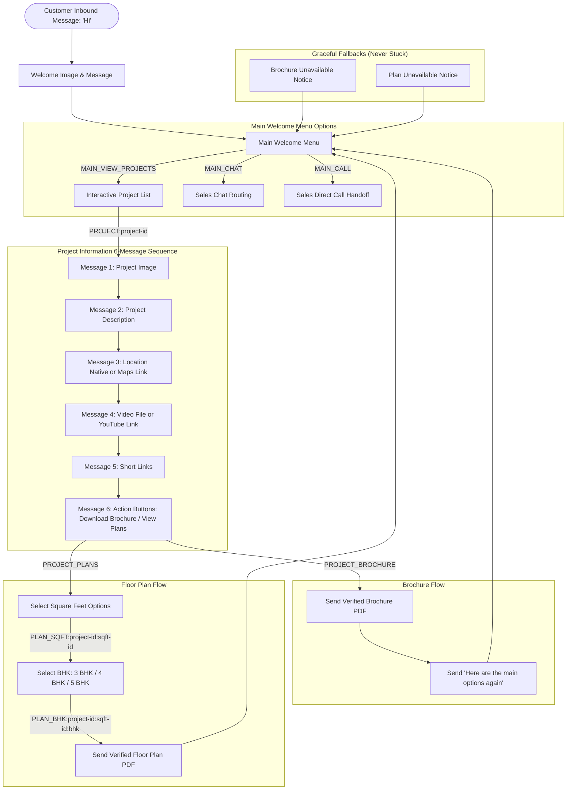

# Real-Estate WhatsApp Automation Flow Specification

This document details the Project Information, Brochure, and Floor Plan automation flow implemented for the Silverstone WhatsApp Automation System using the official Meta WhatsApp Cloud API.

---

## 1. Flow Diagram



---

## 2. Interactive Message Identifiers (Internal IDs)

All business logic relies on stable internal IDs rather than localized or visible button text:

| Action / Button | Stable Internal ID Format | Example | UI Type |
|---|---|---|---|
| **View Projects** | `MAIN_VIEW_PROJECTS` | `MAIN_VIEW_PROJECTS` | Reply Button |
| **Chat with Sales** | `MAIN_CHAT` | `MAIN_CHAT` | Reply Button |
| **Call Sales** | `MAIN_CALL` | `MAIN_CALL` | Reply Button |
| **Select Project** | `PROJECT:<project-id>` | `PROJECT:spring-hill`, `PROJECT:mahal` | List Row |
| **Download Brochure** | `PROJECT_BROCHURE` or `PROJECT_BROCHURE:<project-id>` | `PROJECT_BROCHURE` | Reply Button |
| **View Plans** | `PROJECT_PLANS` or `PROJECT_PLANS:<project-id>` | `PROJECT_PLANS` | Reply Button |
| **Square Feet Option** | `PLAN_SQFT:<project-id>:<sqft-id>` | `PLAN_SQFT:spring-hill:sqft-bhk` | Reply Button (<=3) or List Row (>3) |
| **BHK Selection** | `PLAN_BHK:<project-id>:<sqft-id>:<bhk>` | `PLAN_BHK:spring-hill:sqft-bhk:3BHK` | Reply Button |

---

## 3. Conversation State Machine

Conversation state is managed per customer WhatsApp ID (`waId`) and tracked in memory:

| State | Description | Context Data |
|---|---|---|
| `MAIN_MENU` | Customer is at the main welcome menu | None |
| `PROJECT_LIST` | Customer was sent the interactive list of projects | None |
| `PROJECT_SELECTED` | Customer selected a specific project from the list | `projectId` |
| `PROJECT_INFO` | 6-message project sequence is being delivered | `projectId` |
| `PROJECT_ACTIONS` | "Download Brochure" / "View Plans" options displayed | `projectId` |
| `SELECT_SQFT` | Square feet choices presented to user | `projectId` |
| `SELECT_BHK` | BHK options (3 BHK, 4 BHK, 5 BHK) displayed | `projectId`, `squareFeetId` |
| `BROCHURE_SENT` | Project brochure document delivered | `projectId` |
| `PLAN_SENT` | Project floor plan PDF delivered | `projectId`, `squareFeetId`, `bhk` |
| `CHAT` | Customer routed to sales team chat | None |
| `CALL` | Direct call number presented | None |

---

## 4. Project Data Schema (`data/projects.json`)

All project content is 100% data-driven. No project details, URLs, or filenames are hard-coded in TypeScript code:

```json
{
  "id": "spring-hill",
  "name": "Spring Hill",
  "icon": "🏡",
  "active": true,
  "sortOrder": 1,
  "mainImage": "client-assets/organized/projects/spring-hill/Springhill welcome image.jpeg",
  "description": "*⚜️ SPRINGHILL HOMES ⚜️*\n🏡 PREMIUM ROW HOUSE & PLOTS 🏡...",
  "location": {
    "name": "Spring Hill Location",
    "address": "Spring Hill, 120 ft & 60 ft Junction, Surat",
    "googleMapsUrl": "https://maps.app.goo.gl/Wi7TGhT5QZuHHZp99"
  },
  "video": {
    "url": "https://youtu.be/z-s4KD0q2qk",
    "shortUrl": "https://youtu.be/z-s4KD0q2qk",
    "caption": "Spring Hill Walkthrough Video"
  },
  "links": {
    "location": "https://maps.app.goo.gl/Wi7TGhT5QZuHHZp99",
    "video": "https://youtu.be/z-s4KD0q2qk"
  },
  "brochure": {
    "file": "client-assets/organized/projects/spring-hill/brochure.pdf",
    "filename": "Spring-Hill-Brochure.pdf",
    "caption": "Spring Hill Brochure"
  },
  "plans": {
    "squareFeetOptions": [
      {
        "id": "sqft-84",
        "label": "84 Sq.Yd Plots",
        "bhkOptions": []
      },
      {
        "id": "sqft-124",
        "label": "124 Sq.Yd Anchor Plot",
        "bhkOptions": []
      },
      {
        "id": "sqft-bhk",
        "label": "Row House & Bungalows",
        "bhkOptions": [
          { "id": "3bhk", "label": "3 BHK", "file": "", "filename": "Spring-Hill-3-BHK-Plan.pdf" },
          { "id": "4bhk", "label": "4 BHK", "file": "", "filename": "Spring-Hill-4-BHK-Plan.pdf" },
          { "id": "5bhk", "label": "5 BHK", "file": "", "filename": "Spring-Hill-5-BHK-Plan.pdf" }
        ]
      }
    ]
  }
}
```

---

## 5. Asset Structure & Organization

Project assets are organized under `client-assets/organized/projects/<project-id>/`:

```
client-assets/organized/projects/
├── spring-hill/
│   ├── Springhill welcome image.jpeg
│   └── brochure.pdf
├── mahal/
│   ├── Mahel welcome image.jpeg
│   └── brochure.pdf
├── rajmahal/
│   ├── Raj mahel welcome image.jpeg
│   └── brochure.pdf
├── applewood/
│   ├── Applewood Welcome image.jpeg
│   └── Applewood.pdf
├── elements/
│   ├── ELEMNET.jpg
│   └── brochure.pdf
└── villas/
    ├── Silverstone villa welcome image.jpeg
    └── SilverStone Villas.pdf
```

---

## 6. Error Handling & Customer Protection

1. **Missing Brochure File**:
   - If a customer requests a brochure for an unmapped or missing file, the system does not crash or send empty files.
   - User receives: `"Brochure is currently unavailable. Please contact our sales team."`
   - System immediately displays the Main Welcome Menu (`View Projects`, `Chat`, `Call`).

2. **Missing Floor Plan File**:
   - If a floor plan PDF does not exist on disk, the system never sends another project's PDF or a placeholder.
   - User receives: `"This plan is currently unavailable. Please contact our sales team."`
   - System immediately displays the Main Welcome Menu (`View Projects`, `Chat`, `Call`).

3. **Safe Meta API Error Logging**:
   - HTTP status code, Meta error code, and Meta error message are logged for diagnosis.
   - Under no circumstances are `META_ACCESS_TOKEN`, `META_APP_SECRET`, or `.env` credentials logged.

4. **Idempotency & Duplicate Clicks**:
   - Button double-clicks within 2 seconds are detected and de-duplicated by `isDuplicateAction`.
   - Inbound webhook messages are deduplicated using message IDs with 10-minute cache window.
   - Outbound actions per customer are strictly serialized via `enqueueConversationAction`.

5. **Customer-Facing Filenames**:
   - All sent PDFs use clean, branded filenames (e.g. `Spring-Hill-Brochure.pdf`, `Spring-Hill-1800-SqFt-3-BHK-Plan.pdf`).
   - Internal filesystem paths are never exposed to customers.
